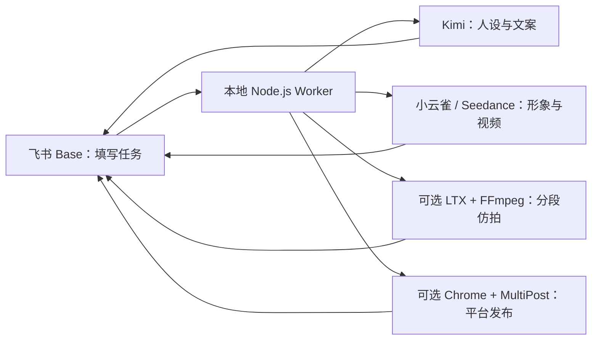

# 飞书账号复刻工具

用飞书多维表格发起任务，在自己的电脑上自动完成人设生成、参考视频换人、LTX 分段仿拍和可选的多平台发布。

> 这不是“拿到一个飞书链接就能免费生成”的云服务。每位部署者需要导入自己的飞书 Base、登录飞书 CLI，并配置自己的 Kimi/小云雀等服务密钥；模型调用可能产生费用。请只处理已获授权的人脸、视频、音频和平台账号。

## 能做什么

- Kimi 根据要求生成人设，小云雀生成真人风格人物形象并回填飞书附件。
- 可选参考人脸图片，锁定同一人物身份，同时按人设重新生成服装、造型和场景。
- 下载参考视频，使用 Seedance 2.0 / Fast / Mini 进行人物替换和竖屏仿拍。
- 可选 LTX 流程：Kimi 分镜、LTX 动态分段、FFmpeg 合成并复用原音轨。
- Kimi 生成平台标题、文案和标签；确认后由本机 Chrome + MultiPost 发布并回写结果。
- 失败原因、任务 ID、结果链接和附件均回填至飞书。



## 部署要求

核心生成功能支持 Windows、macOS 和 Linux，推荐 Node.js 20 或更高版本。自动发布模块依赖桌面 Chrome，目前按 Windows 流程维护。

必须安装：

- [Node.js 20+](https://nodejs.org/)
- [飞书 CLI](https://github.com/larksuite/cli)
- [yt-dlp](https://github.com/yt-dlp/yt-dlp)
- [FFmpeg](https://ffmpeg.org/)
- Kimi API Key 和小云雀 `XYQ_ACCESS_KEY`

可选安装：

- LTX 模式：OpenAI 兼容视频接口和 Cloudflared
- 平台自动发布：Chrome 与仓库内的 MultiPost 扩展

## 1. 下载并安装

```powershell
git clone https://github.com/3483500137/feishu-ecommerce-video-worker.git
cd feishu-ecommerce-video-worker
npm install
npm install --global @larksuite/cli
lark-cli auth login
```

macOS/Linux 也可使用相同的 `git`、`npm` 和 `lark-cli` 命令。完成登录后运行 `lark-cli whoami` 确认当前飞书身份。

## 2. 导入飞书模板

仓库中的模板只含 5 张表、视图、字段和自动化结构，不含原项目的任何记录：

```powershell
lark-cli drive +import --file .\templates\feishu-account-cloner-template.base --type bitable --name "飞书账号复刻工具" --as user
```

macOS/Linux 将路径写为 `./templates/feishu-account-cloner-template.base`。导入成功后打开新 Base，确认当前飞书账号拥有编辑权限。

不要让陌生人直接共用你的生产 Base 链接。链接访问仍受飞书权限控制，但有编辑权限的人会向同一张任务表写数据，而运行结果和费用会由连接该 Base 的 Worker 与 API 凭证承担。开源使用者应各自导入模板、各自部署 Worker。

## 3. 填写配置

复制示例配置：

```powershell
Copy-Item .\config.example.json .\config.json
```

macOS/Linux：

```bash
cp ./config.example.json ./config.json
```

编辑 `config.json`：

- `base_token`：Base URL 中 `/base/` 后的 token。
- `*_table_id`：打开对应数据表后，URL 查询参数 `table=` 的值。
- `persona_image_attachment_field_id`：人设表“人物形象”附件字段 ID。
- `ltx_*`、`platform_*`：使用相应可选模块时填写。
- `yt_dlp_command`：yt-dlp 已加入 PATH 时保持默认，否则填写可执行文件绝对路径。FFmpeg 需要加入 PATH。

可用飞书 CLI 查看字段 ID：

```powershell
lark-cli base +field-list --base-token YOUR_BASE_TOKEN --table-id YOUR_TABLE_ID --as user --format table
```

配置文件默认读取项目根目录的 `config.json`。也可用 `FEISHU_ACCOUNT_CLONER_CONFIG` 指向其他位置，便于多实例部署。

## 4. 设置密钥

Windows PowerShell：

```powershell
[Environment]::SetEnvironmentVariable('KIMI_API_KEY', '替换为自己的密钥', 'User')
[Environment]::SetEnvironmentVariable('XYQ_ACCESS_KEY', '替换为自己的密钥', 'User')
# 仅 LTX 模式需要
[Environment]::SetEnvironmentVariable('NEWAPI_API_KEY', '替换为自己的密钥', 'User')
```

重新打开终端后生效。macOS/Linux 可将变量写入自己的 shell 密钥管理方案，或在当前会话中 `export KIMI_API_KEY=...`、`export XYQ_ACCESS_KEY=...`。不要把真实密钥写进 `config.json` 或提交到 Git。

## 5. 自检与运行

```powershell
npm run doctor
npm test
npm start
```

`doctor` 只输出配置项名称和状态，不输出密钥内容。`npm start` 扫描一轮后退出，适合交给计划任务或其他进程管理器重复执行。

Windows 可安装每分钟运行一次、禁止重叠的计划任务：

```powershell
powershell -ExecutionPolicy Bypass -File .\scripts\install-scheduled-task.ps1
```

计划任务名为 `FeishuAccountClonerWorker`。安装脚本会移除旧版本精确命名的 `FeishuEcommerceVideoWorker`，避免两个 Worker 同时处理任务。

## 飞书中的使用方法

1. 在“人设管理”新增记录，填写人设类型、要求和可选参考图片，将“是否立刻生成人设”设为“是”。
2. 等待“人设生成状态”变为“已完成”，检查回填的人设和人物形象。
3. 在“内容管理”关联人设，粘贴参考视频链接或附件，选择模型，将“是否立刻生成视频”设为“是”。
4. 在“平台发布”关联内容和平台账号；文案生成后先人工检查，再把“确认发布”设为“是”。
5. 失败时查看“失败原因”。修改输入后按表内重试字段或触发选项重新执行，不要手工复制任务 ID。

## 可选：LTX 分段仿拍

LTX 会按 `向上取整(参考时长 ÷ 5 秒)` 动态分段，当前支持最长 60 秒。每段生成 704×1280、5 秒视频，最终统一为 720×1280、按参考时长裁切，并复用参考音轨。结果属于同类型近似仿拍，不保证人物细节、动作和镜头完全一致。

Windows 安装临时 HTTPS 中继：

```powershell
winget install --id Cloudflare.cloudflared
powershell -ExecutionPolicy Bypass -File .\scripts\install-media-relay.ps1
```

计划任务名为 `FeishuAccountClonerMediaRelay`。Quick Tunnel 域名会在重启后变化，只适合个人部署和测试；生成期间电脑、中继和网络必须在线。生产用途应使用自己的固定 HTTPS 中继。`ltx_base_url` 也必须使用 HTTPS，避免密钥明文传输。

## 可选：MultiPost 自动发布

1. 打开 `chrome://extensions`，启用“开发者模式”。
2. 点击“加载已解压的扩展程序”，选择 `vendor/MultiPost-1.3.8`。
3. 安装本地账号/发布桥接服务：

```powershell
powershell -ExecutionPolicy Bypass -File .\scripts\install-multipost-account-server.ps1
```

计划任务名为 `FeishuAccountClonerMultiPost`。首次从飞书“获取MultiPost”链接访问本机服务时，在扩展弹窗中允许 `127.0.0.1`。本地服务不保存平台密码、Cookie 或验证码，但扩展会使用当前 Chrome 配置文件的登录态。

发布安全门禁：

- 只有文案已完成、发布状态为待确认且“确认发布=是”的记录才会提交。
- 已有 MultiPost 任务 ID 或幂等键的记录不会重复提交。
- 当前 Chrome 登录账号必须与飞书“平台账号”记录一致。
- 登录失效、账号不一致、验证码或平台风控会停止发布并回填失败原因。

MultiPost 上游来源与本项目修改说明见 [THIRD_PARTY_NOTICES.md](THIRD_PARTY_NOTICES.md)。

## 常见问题

**别人拿到我的飞书链接能直接生成吗？** 只有获得 Base 权限且你的 Worker 正在运行时才可能触发任务；调用使用的是部署 Worker 那台电脑的凭证。推荐让对方导入模板并使用自己的服务账号，不要多人共用生产 Base 和密钥。

**模块导入时报 `config.json` 不存在？** 当前版本允许测试和代码导入在无配置时运行；只有真正启动 Worker 时才要求有效配置。先运行 `npm run doctor` 查看缺项。

**飞书 CLI 找不到？** 运行 `npm install --global @larksuite/cli`，或把 CLI 的 JS 入口路径写入 `LARK_CLI_PATH`。

**视频下载失败？** 确认 `yt-dlp --version` 和 `ffmpeg -version` 可运行。部分平台需要登录或 Cookie，本项目不会绕过平台访问控制。

## 开发与安全

```powershell
npm test
```

项目采用 MIT License；内置修改版 MultiPost 仍受 Apache License 2.0 约束。安全报告方式见 [SECURITY.md](SECURITY.md)。
