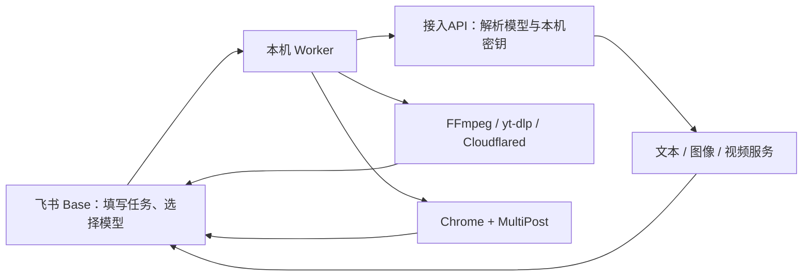

# 飞书账号复刻工具

以飞书多维表格为任务台，在自己的 Windows 电脑上编排人设生成、参考视频复刻、多模型视频生成和可选的多平台发布。

> 这是自托管工作流，不是“获得飞书链接即可免费生成”的在线服务。每位部署者都应导入自己的 Base、配置自己的模型接口和本机密钥，并自行承担模型费用。请只使用已获授权的人脸、视频、声音和平台账号。

## 当前能力

| 模块 | 用途 | 是否必需 |
|---|---|---|
| 教程说明 | Base 内嵌操作教程 | 建议阅读 |
| 接入API | 一模型一行，配置协议、能力、默认用途和本机密钥 | 必需 |
| 人设管理 | 生成人设文字与真人风格人物形象 | 必需 |
| 小云雀内容管理 | 使用人物形象和参考视频生成竖屏复刻视频 | 可选 |
| 中转站生成内容管理 | 支持文生视频、图生视频、首尾帧和参考视频生成 | 可选 |
| LTX内容管理 | Kimi/文本模型分镜，LTX 分段生成，FFmpeg 合成 | 可选 |
| 平台账号、平台发布 | 绑定当前 Chrome 账号，生成文案并通过 MultiPost 发布 | 可选 |



## 部署要求

当前完整部署以 Windows 10/11 为主，因为模型密钥默认使用 Windows DPAPI 加密。需要：

- Node.js 20 或更高版本
- Git
- [飞书 CLI](https://github.com/larksuite/cli)
- FFmpeg
- yt-dlp
- 需要使用的文本、图像或视频模型账号

可选：

- LTX 首尾帧流程：Cloudflared
- 平台发布：Chrome 和仓库内置的 MultiPost 扩展

## 快速部署

### 1. 下载项目

```powershell
git clone https://github.com/3483500137/feishu-ecommerce-video-worker.git
cd feishu-ecommerce-video-worker
npm install
npm install --global @larksuite/cli
lark-cli auth login
```

完成登录后运行 `lark-cli whoami`，确认 CLI 使用的是有权编辑目标 Base 的飞书账号。

### 2. 导入 Base 模板

```powershell
lark-cli drive +import `
  --file .\templates\feishu-account-cloner-template.base `
  --type bitable `
  --name "飞书账号复刻工具" `
  --as user
```

模板只包含 7 张表、仪表盘和 3 个禁用的自动化占位项，不包含原项目业务记录、API Key、浏览器登录态、生产 Base token 或旧自动化地址。生成任务由本机 Worker 和 Windows 计划任务接管，请不要启用这些占位自动化。教程源文件位于 [docs/feishu-base-tutorial.md](docs/feishu-base-tutorial.md)；导入模板后，可将它复制到 Base 左侧的“教程说明”文档中。

已有旧版 Base 时不必重新导入，可运行增量脚本补齐模型路由字段：

```powershell
powershell -ExecutionPolicy Bypass -File .\scripts\configure-model-routing-base.ps1
```

脚本只新增或补充字段，不删除历史记录。

### 3. 填写本机配置

```powershell
Copy-Item .\config.example.json .\config.json
```

编辑 `config.json`：

- `base_token`：Base 地址中 `/base/` 后的 token。
- `persona_table_id`、`content_table_id`、`access_api_table_id`：核心表 ID。
- `relay_content_table_id`、`ltx_content_table_id`、`platform_*`：启用对应模块时填写。
- `*_attachment_field_id`：对应最终附件字段的 field ID。
- `yt_dlp_command`：已加入 PATH 时保持 `yt-dlp`，否则填写可执行文件绝对路径。

可用 CLI 查看表和字段：

```powershell
lark-cli base +table-list --base-token YOUR_BASE_TOKEN --as user --format table
lark-cli base +field-list --base-token YOUR_BASE_TOKEN --table-id YOUR_TABLE_ID --as user --format table
```

也可通过用户环境变量 `FEISHU_ACCOUNT_CLONER_CONFIG` 指向其他配置文件。

### 4. 启动本地配置服务

“接入API”的“配置接入”和“平台账号”的“获取MultiPost”都依赖本机 `127.0.0.1:17386` 服务：

```powershell
powershell -ExecutionPolicy Bypass -File .\scripts\install-multipost-account-server.ps1
```

计划任务名为 `FeishuAccountClonerMultiPost`。也可前台调试：

```powershell
npm run start:multipost-account
```

### 5. 在“接入API”配置模型

一行只代表一个模型：

1. 填写接入名称、服务商类型、API 协议、接口地址、模型名称和模型 ID。
2. 勾选模型能力：文本、视觉分析、图像生成或视频生成。
3. 点击“配置接入”，在本机页面输入 API Key/Access Key。
4. 点击验证；OpenAI 兼容接口可读取模型列表并批量导入。
5. 按用途设置“是否默认”：人设文本、人物形象、提示词、视频生成或发布文案。

密钥保存于 `runtime/credentials.json`，其中只有 Windows DPAPI 密文、密钥尾号和更新时间。密文与当前 Windows 用户和电脑绑定，换电脑后必须重新导入。

旧环境变量 `KIMI_API_KEY`、`XYQ_ACCESS_KEY`、`NEWAPI_API_KEY` 仅作为迁移后备。完成“接入API”配置后可以删除。

### 6. 自检并安装 Worker

```powershell
npm run doctor
npm test
powershell -ExecutionPolicy Bypass -File .\scripts\install-scheduled-task.ps1
```

计划任务：

- `FeishuAccountClonerWorker`：每分钟扫描一次，禁止重叠运行。
- `FeishuAccountClonerWorkerController`：确保生成 Worker 不被平台发布状态错误停用。

安装脚本会清理精确命名的旧任务 `FeishuEcommerceVideoWorker*`。

## 日常使用

完整逐表教程见 [docs/feishu-base-tutorial.md](docs/feishu-base-tutorial.md)。当前生产 Base 已同步到左侧的“教程说明”；新导入的结构模板需要自行创建同名文档并粘贴教程。

### 人设管理

填写手机编号、人设要求和可选参考图片，选择人设文本模型、人物形象模型，将“是否立刻生成人设”设为“是”。完成后检查“人设”和“人物形象”。

参考图片只锁定人脸身份；服装、场景和全身构图仍由人设要求控制。

### 小云雀内容管理

选择已经生成图片的人设，填写参考视频链接或上传参考视频文件，选择视频模型，将“是否立刻生成视频”设为“是”。系统会上传人物形象和参考素材，轮询小云雀任务，并回填最终视频链接及可预览附件。

### 中转站生成内容管理

支持：

- 文生视频
- 图生视频
- 首尾帧生成
- 参考视频生成

选择文本/分析模型和视频生成模型，填写输入内容要求与素材。“生成视频提示词”可选“是”或“重新生成”；“是否立刻生成视频”可选“是”或“重试生成”。取得外部任务 ID 后只会轮询原任务，不会重复提交。

参考视频生成固定为 9:16，并以检测到的参考视频真实时长为准。随机种子可留空；需要复现时再填写整数。

### LTX内容管理

LTX 按参考视频时长动态拆成 5 秒片段：

- `LTX 2.3 单帧`：每段使用起始帧。
- `LTX 2.3 首尾帧`：每段使用相邻边界帧，连续性更好。

Worker 会通过临时 HTTPS 中继提供边界帧，生成后用 FFmpeg 合并片段、裁切到参考时长并复用参考音轨。需要先安装中继：

```powershell
winget install --id Cloudflare.cloudflared
powershell -ExecutionPolicy Bypass -File .\scripts\install-media-relay.ps1
```

计划任务名为 `FeishuAccountClonerMediaRelay`。Quick Tunnel 适合个人部署和测试，正式环境建议使用自己的固定 HTTPS 中继。

### 平台发布

1. 在 `chrome://extensions` 开启开发者模式。
2. 加载已解压扩展 `vendor\MultiPost-1.3.8`。
3. 在“平台账号”选择平台，点击“获取MultiPost”，绑定当前 Chrome 登录账号。
4. 在“平台发布”关联内容与平台账号，生成并人工审核标题、文案和标签。
5. 只有确认无误后，才把“确认发布”设为“是”。

安全门禁：

- 文案状态必须为已完成，发布状态必须为待确认。
- 已有 MultiPost 任务 ID 或幂等键时不会重复提交。
- 当前 Chrome 账号必须与飞书绑定账号一致。
- 验证码、扫码登录和平台风控仍需人工处理。

## 状态与重试

- `待生成`：输入已准备，尚未提交。
- `生成中`：已提交或正在轮询；有外部任务 ID 时会继续原任务。
- `已完成`：真实产物已回填。
- `失败`：先看“失败原因”，修正配置或素材后再使用明确的重试选项。

不要手工清除线程 ID、运行 ID、外部任务 ID、幂等键或模型快照。直接清除可能导致重复收费或无法恢复任务。

## 安全与开源

- `config.json`、`runtime/`、`logs/`、`.env*` 和媒体文件默认不进入 Git。
- API Key 不写入 Base、README 或 `config.json`。
- Base 模板发布前会进行结构导出和敏感标识脱敏。
- MultiPost 修改版的上游许可证及修改说明见 [THIRD_PARTY_NOTICES.md](THIRD_PARTY_NOTICES.md)。
- 安全问题请按 [SECURITY.md](SECURITY.md) 私下报告。

## 开发验证

```powershell
npm test
npm run doctor
```

主项目采用 MIT License；内置 MultiPost 扩展继续遵守 Apache License 2.0。
